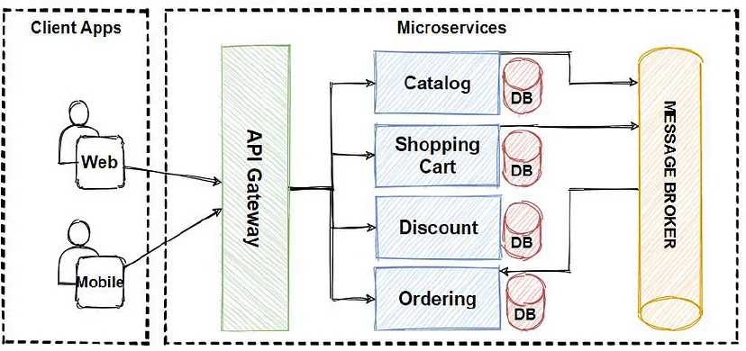

# Microservices Architecture

## Table of Contents

- [Monolithic Services](#monolithic-services)
- [Microservices](#microservices)
- [Comparison of Monolithic and Microservices Architectures](#comparison-of-monolithic-and-microservices-architectures)
- [Loosely Coupled](#loosely-coupled)
- [Tightly Coupled](#tightly-coupled)
- [Microservice Decomposition Pattern](#microservice-decomposition-pattern)
- [Strangler Pattern in Microservices](#strangler-pattern-in-microservices)
- [Saga Pattern in Microservices](#saga-pattern-in-microservices)
- [CQRS in Microservices](#cqrs-in-microservices)

## Monolithic Services

Think of a monolithic service as a big single block. It’s one large application where all the features and functions are tightly packed together. For example, imagine an online store app. In a monolithic system, the user interface, payment processing, product catalog, and inventory management are all part of one big program.

**Advantages:**
- Easier to develop initially since everything is in one place.
- Testing can be straightforward because you’re dealing with one system.

**Disadvantages:**
- If one part breaks, the whole system can crash.
- Harder to scale because you have to scale the entire application even if only one part is under heavy use.
- Making changes or updates is tricky—small updates can impact the entire system.

## Microservices

Microservices break the application into small, independent services. Each service handles one specific feature (e.g., payments, product catalog, or user management). These services talk to each other through APIs (like sending messages back and forth).

**Advantages:**
- Each service can be developed, deployed, and scaled independently.
- If one service fails, the rest of the system can keep running.
- Teams can work on different services simultaneously, which speeds up development.

**Disadvantages:**
- Managing lots of small services can get complicated.
- Communication between services adds overhead (e.g., network delays).
- Debugging issues can be harder because problems might span multiple services.

## Comparison of Monolithic and Microservices Architectures

| Aspect | Monolithic Architecture | Microservices Architecture |
| --- | --- | --- |
| **Structure** | Single, unified application. | Composed of small, independent services. |
| **Development** | Single codebase, tightly coupled components. | Separate codebases, loosely coupled services. |
| **Deployment** | Entire application deployed as one unit. | Each service deployed independently. |
| **Scalability** | Scales by replicating the whole application. | Individual services scale independently. |
| **Technology Stack** | Typically uses a single technology stack. | Different services can use different technologies. |
| **Fault Isolation** | Failure in one part can crash the entire application. | Failures are isolated to individual services. |
| **Maintenance** | Harder to maintain as the codebase grows. | Easier to maintain; changes are confined to specific services. |
| **Upgrades** | Entire application needs testing and redeployment for changes. | Updates can be made to specific services without affecting others. |
| **Communication** | Internal communication is simple within one process. | Services communicate over networks (e.g., APIs, messaging systems). |
| **Team Organization** | Cross-functional teams work on the whole system. | Teams focus on specific services with end-to-end responsibility. |
| **Initial Cost** | Lower due to simpler architecture. | Higher due to complexity in design and infrastructure. |
| **Long-Term Cost** | Can increase due to scaling and maintenance challenges. | More cost-efficient for large, scalable systems. |
| **Use Cases** | Best for small to medium-sized applications. | Ideal for large, complex, and scalable systems. |

## Loosely Coupled

In a loosely coupled microservices architecture, each service is designed to work independently, interacting with others only through well-defined APIs. This independence means that a change in one service, such as updating features or fixing bugs, does not directly affect other services as long as the API contract remains the same. This makes the system more flexible, easier to scale, and simpler to maintain because each service can be updated or deployed without disrupting the entire application.

## Tightly Coupled

In a tightly coupled microservices architecture, services are interdependent and often share databases, internal logic, or tightly linked workflows. A change in one service frequently requires changes in others, making the system harder to maintain and deploy. This setup can lead to significant challenges when scaling or updating the application, as even minor changes can cascade and impact multiple parts of the system.

---
## Microservice Decomposition Pattern

When we decide to move from a monolithic application to microservices, the most important step is figuring out how to split things up—this is what we call the microservice decomposition pattern. It’s like breaking a big, tightly connected puzzle into independent, manageable pieces.

### Decomposition Approaches

1. **By Business Capability**

    This is probably the most logical and popular way. You look at the business and ask: “What are the key functions or areas of this business?” Each capability becomes its own service. For example:
    - In an e-commerce app, you'd have services like Orders, Payments, Shipping, and Inventory.

    **Why this works well:**
    - Business capabilities don’t change much over time, so your boundaries are stable.
    - Teams understand them easily because they align with what the business does.

2. **By Subdomain (Using Domain-Driven Design)**

    Here, we use Domain-Driven Design (DDD) principles to split things by subdomains. Imagine the business as a collection of smaller domains or areas. Each area has clear responsibilities, and we design microservices around those boundaries. Example:
    - In a banking app, subdomains could be Customer Management, Loans, and Transactions.

    **Why this is effective:**
    - DDD helps us define Bounded Contexts—clear boundaries that ensure services don’t interfere with each other.
    - It's great for complex systems where business rules vary a lot between areas.

3. **By Resource/Entity**

    Sometimes, it’s easier to think about what the system manages rather than capabilities. We create services around the main entities in the system, like Flights, Hotels, or Customers. Example:
    - A travel site might have separate services for each type of resource: one for handling flights, one for hotel bookings, etc.

    **Why this helps:**
    - It keeps things simple by focusing on tangible, core objects in the system.

4. **By Workflow or Process**

    Some systems are all about processes or workflows. You can break them down by steps in those processes. Example:
    - For an order system, you might have: A service for Order Placement (when users place orders), A service for Payment Processing, A service for Order Fulfillment (delivery).

    **Why this works:**
    - It makes each step of the workflow easy to scale and improve independently.

5. **By Team Organization**

    This approach says: “Let’s build microservices to match how our teams work.” If a team handles customer issues, they own the Customer Support Service. If another team manages payments, they own the Payment Service.

    **Why this is useful:**
    - It’s practical. Teams can work independently, which speeds up delivery and reduces bottlenecks.

## Strangler Pattern in Microservices

The Strangler Pattern is a method for gradually replacing a legacy monolith with microservices. Instead of rewriting everything from scratch, you replace pieces of the old system step by step, allowing both the old and new systems to coexist during the transition.

### Why Use the Strangler Pattern?

Rewriting a large, complex monolith all at once is risky, time-consuming, and prone to failure. With the Strangler Pattern, you can:
- Modernize incrementally.
- Deliver value sooner, as each new piece is built.
- Avoid disruption to users since the system keeps running during the transition.

### How Does It Work?

1. **Start with a Proxy Layer**

    Place a proxy (like an API gateway or a routing layer) in front of the monolith. This proxy directs requests to the correct part of the system—either the legacy monolith or a new microservice.
    - **Example:** A request for “Get Customer Data” might still go to the monolith initially.

2. **Identify a Functionality to Replace**

    Find a small, independent feature in the monolith that can be migrated to a microservice.
    - **Example:** In an e-commerce system, you might start with Order History.

3. **Build the Microservice**

    Develop the microservice for the selected functionality. Connect it to its own database, ensuring it works independently.

4. **Redirect Traffic**

    Update the proxy to route requests for that specific functionality to the new microservice instead of the monolith.
    - **Example:** Now, requests for Order History go to the microservice.

5. **Repeat for Other Features**

    One by one, identify more features in the monolith, build corresponding microservices, and update the proxy to redirect traffic. Over time, the monolith shrinks until it’s completely replaced by microservices.

### Key Benefits

**Reduced Risk**
- The system keeps running during migration, so you don’t risk downtime or major failures.

**Incremental Delivery**
- You can deliver new features and improvements sooner without waiting for the entire system to be rebuilt.

**Flexibility**
- You can prioritize which parts of the monolith to replace first, based on business needs.

### Challenges

**Complexity of Coexistence**
- Managing both the monolith and microservices during the transition can get tricky.
- There’s often overlap or duplication of functionality temporarily.

**Data Management**
- Splitting the database is challenging, especially if the monolith and microservices need to share data during migration.

**Technical Debt**
- If you don’t fully replace the monolith, parts of it may linger, creating long-term maintenance challenges.

### Simple Analogy
Imagine your monolith is an old tree with tangled branches. Instead of cutting it down all at once (risky), you grow a new vine (microservices) around it. As the vine grows and takes over functionality, you gradually prune away the old tree until it’s gone.

### Real-World Example
- Let’s say a legacy banking app needs modernization.
    - **Step 1:** Start with the Account Summary feature. Build a microservice for it.
    - **Step 2:** Redirect traffic for account summaries to the new service.
    - **Step 3:** Move to another feature, like Transaction History, and repeat.
- Over time, the app fully transitions to microservices, without any big downtime or massive rewrites.

The Strangler Pattern is a practical, low-risk approach to modernizing systems in a controlled and iterative way. It ensures that your system evolves smoothly without disrupting users or business operations.

---
## Saga Pattern in Microservices

The Saga Pattern is a way to handle distributed transactions in a microservices architecture. In a monolithic system, you might use a single database transaction to ensure consistency, but in microservices, each service often has its own database. The Saga Pattern ensures that multiple services can work together to complete a task while maintaining data consistency.

### What’s the Problem?

In microservices:
- Each service handles its own data and logic.
- If a task involves multiple services (like placing an order, updating inventory, and processing payment), you can’t use a single transaction to ensure all steps succeed or fail together.

The Saga Pattern solves this by managing the sequence of steps and ensuring the system stays consistent, even if some steps fail.

### How Does the Saga Pattern Work?

The Saga Pattern breaks a distributed transaction into a series of smaller steps. Each step is a local transaction managed by an individual service. If something goes wrong, compensating actions are triggered to undo the effects of previous steps.

#### Two Ways to Implement the Saga Pattern

1. **Choreography (Event-Based)**

    - Each service listens for and reacts to **events**.
    - Services don’t directly call each other; instead, they communicate via an event bus or message broker.

    **Example:**
    - Step 1: The **Order Service** creates an order and publishes an Order Created event.
    - Step 2: The **Inventory Service** listens for this event, reserves stock, and publishes a Stock Reserved event.
    - Step 3: The **Payment Service** listens for Stock Reserved, processes payment, and publishes Payment Completed.

    **Compensation:**
    - If payment fails, the Inventory Service listens for a Payment Failed event and rolls back the stock reservation.

    **Advantages:**
    - Loosely coupled services.
    - Easier to scale since there’s no central coordinator.

    **Challenges:**
    - Harder to debug and monitor since logic is spread across multiple services.
    - Event chains can get complex.

2. **Orchestration (Centralized Control)**

    A central **orchestrator** (a dedicated service) manages the sequence of steps. The orchestrator calls each service and decides what to do next based on the results.

    **Example:**
    - Step 1: The orchestrator tells the **Order Service** to create an order.
    - Step 2: It then calls the **Inventory Service** to reserve stock.
    - Step 3: Next, it calls the **Payment Service** to process the payment.

    **Compensation:**
    - If payment fails, the orchestrator tells the Inventory Service to roll back the stock reservation.

    **Advantages:**
    - Easier to understand and debug because all logic is in one place.
    - Centralized error handling.

    **Challenges:**
    - The orchestrator can become a bottleneck or single point of failure.

### When to Use the Saga Pattern?

- When a task spans multiple microservices and you need consistency across them.
- When it’s acceptable to handle failures by compensating (undoing work), rather than requiring everything to succeed in one go.

### Example Scenarios

- **E-commerce Order Processing:** Reserve stock, process payment, and confirm the order.
- **Travel Booking:** Book a flight, reserve a hotel, and confirm a car rental.

### Challenges of Sagas

**Compensating Transactions:**
- Writing compensating actions for every step can be complex and error-prone.

**Handling Failures:**
- Deciding when to retry or abort the entire saga is tricky.

**Monitoring and Debugging:**
- With choreography, it’s hard to trace what went wrong in a distributed system.

### Simple Analogy

Imagine planning a vacation:
- Book a flight.
- Reserve a hotel.
- Rent a car.
- If the hotel is unavailable, you cancel the flight and the car rental. This is how a saga works—it either completes all steps or compensates to undo them.

### Key Takeaways

- The Saga Pattern ensures **data consistency** across microservices without using a distributed transaction.
- **Choreography** works best for loosely coupled, event-driven systems.
- **Orchestration** is better for centralized control and simpler workflows.

---
## CQRS in Microservices

CQRS is an architectural pattern that separates the operations of reading and writing data. In the context of microservices, this pattern can help you handle scalability, performance, and consistency challenges effectively. Here’s a simple breakdown:

### Key Idea

- **Command:** Responsible for writing data or performing operations that change the system's state (e.g., creating, updating, or deleting records).
- **Query:** Responsible for reading data or fetching information without altering the system's state.

### How it Works

Instead of having a single model or service that handles both reading and writing, you split them into two separate parts:

**Write Side (Command Model):**

- Handles commands like CreateUser, UpdateOrder, or DeleteItem.
- Often backed by a transactional store optimized for writes.
- Enforces business rules and validations.

**Read Side (Query Model):**

- Handles queries like GetUserDetails or ListOrders.
- Uses a separate data model optimized for fast reads (e.g., pre-aggregated views or denormalized data).

### In Microservices

Each microservice can independently implement CQRS principles:

**Separate Databases:**

- The write side might use a normalized SQL database for ACID transactions.
- The read side might use a NoSQL store, cache, or search engine for fast lookups.

**Event-Driven Communication:**

- When a command executes, the write side publishes events (e.g., UserCreated, OrderUpdated).
- The read side listens to these events and updates its data store accordingly.

**Scalability:**

- Read-heavy systems can scale the read side independently by adding more read replicas or caching layers.
- Write-heavy systems can optimize the command side without affecting the read performance.

### Example: E-Commerce Application

**Without CQRS:**
- A single service handles both reading product information and updating inventory.
- Scaling becomes tricky as both operations compete for resources.

**With CQRS:**

**Command Side:**
- PlaceOrder command writes to the Orders database.
- Triggers an OrderPlaced event.

**Query Side:**
- A separate service listens to OrderPlaced, updates a query database with denormalized views of orders.
- The query service directly answers GetOrderDetails or ListCustomerOrders requests.

### Benefits

- **Scalability:** Independently scale read and write models.
- **Performance:** Optimize each side for its specific workload.
- **Flexibility:** Different databases can be used for reads and writes.
- **Separation of Concerns:** Cleanly separates business logic from querying logic.

### Challenges

- **Complexity:** Requires more infrastructure and careful design.
- **Eventual Consistency:** The read model might lag slightly behind the write model.
- **Event Management:** You need robust mechanisms for event handling and data synchronization.

In short, CQRS helps you design microservices with clear responsibilities, making them more scalable and performant at the cost of added complexity.
